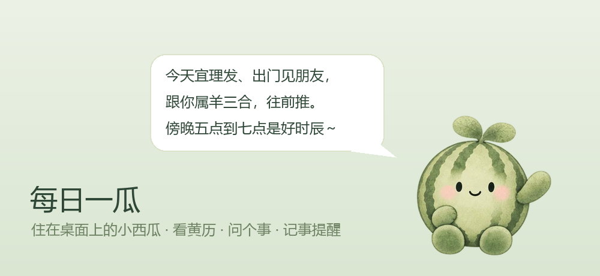
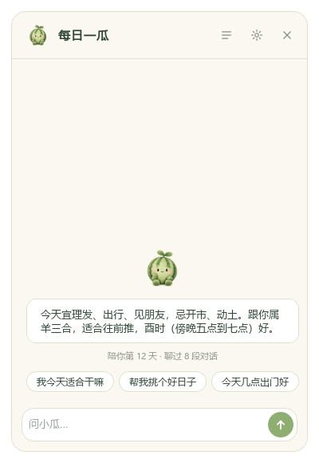
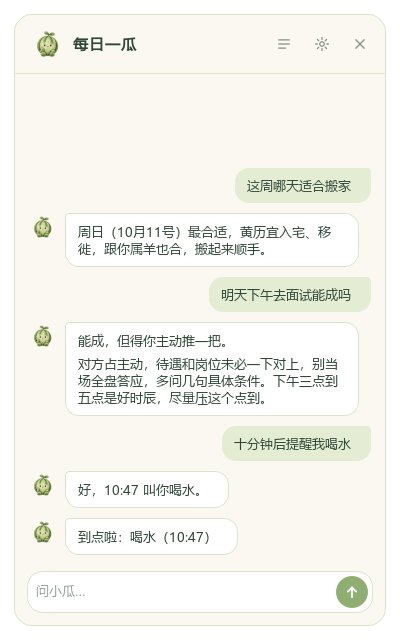

<div align="center">



# 每日一瓜 · 小瓜桌宠 🍉

**一只住在你桌面角落的小西瓜。**
会翻黄历，会帮你起一卦，会记住你的事，到点还会招手叫你。

[⬇️ 下载安装包](https://github.com/hamburger-lie/xiaogua-desktop-pet/releases/latest) · Windows 10 / 11 · 免费 · 个人使用

已经下载了源代码压缩包？解压后，双击最外层的 **`XiaoguaDesktopPet-Setup-1.0.0.exe`** 就能安装。

</div>

---

## 认识一下小瓜

小瓜是一只浅绿色的小西瓜，头顶两片嫩芽，豆豆眼，脸上有点腮红。它不吵，平时就在桌面角落发呆、呼吸、偶尔点个头。

你点它一下，它就转过身来听你说话。


- 你在打字，它会**歪着头听**；
- 它在想事情的时候会**托腮**、**翻黄历**、**摆卦**；
- 想到答案了会**灵光一闪**，说话的时候会**一颠一颠**；
- 鼠标在它头上来回蹭，它会**被摸头**，害羞地「嘿嘿」；
- 把它拎起来，它会**悬在半空晃来晃去**，放下来还会弹一下；
- 半夜十一点以后没人理它，它会**打哈欠、垫着垫子睡着**。

## 小瓜能帮你干嘛

| | |
|---|---|
| 📅 **每天第一句** | 第一次点它，它先告诉你今天宜什么、忌什么，跟你的属相合不合，哪个时辰好。 |
| 🔮 **一件事能不能成** | 「明天面试能成吗」「这单签不签」：它用**梅花易数**起一卦，第一句先给结论，再用大白话讲为什么。 |
| 🗓️ **挑日子** | 「这周哪天适合搬家」：从老黄历里挑出宜做这件事、又不冲你属相的日子。 |
| ⏰ **到点叫你** | 「下午三点提醒我交报告」「十分钟后叫我喝水」：到点它会招手冒泡，藏起来了就发 Windows 通知。 |
| 🧠 **记得你** | 你的称呼、你的属相、你说过的计划。过了的计划，它还会问一句「后来怎么样了？」 |
| 💬 **好好聊天** | 多个对话随时切换；能撤回、删除、让它重新回答；删掉的对话在回收站放 30 天。 |
| 🫧 **不碍事** | 能缩成贴在屏幕边的小球，能开鼠标穿透，也能调大小和透明度。 |

<div align="center">
 &nbsp; 
</div>

### 小瓜说话算不算数？

小瓜背后是大模型，但**卦和黄历都不是模型编出来的**：

- 卦是程序按传统的「年月日时起卦法」真算出来的，卦义查的是书；
- 黄历来自寿星万年历（lunar_python），宜忌依《协纪辨方书》；
- 模型说的时辰跟黄历对不上，程序会退回让它重说；它说了一个根本没起过的卦，程序也会拦下来；
- 「必然」「注定」「大凶」这类吓人的话，程序会直接改掉。

黄历和卦只是老祖宗的一种看法，**当个参考，拿主意的还是你自己**。看病、打官司、投资这类事，小瓜只会劝你去找专业的人。

---

## 三步装好（傻瓜式）

**1. 下载**

两种方式都行，下到的是同一个安装包（大约 60MB）：

- 到 [Releases 页面](https://github.com/hamburger-lie/xiaogua-desktop-pet/releases/latest)，在 **Assets** 下面点 `XiaoguaDesktopPet-Setup-x.x.x.exe` 下载；
- 或者在仓库首页点绿色的 **Code → Download ZIP**，解压后最外层就有 `XiaoguaDesktopPet-Setup-x.x.x.exe`。

**2. 双击安装**

不需要管理员权限，点「下一步」就行。装完小瓜会出现在屏幕右下角。

> 💡 如果弹出「Windows 已保护你的电脑」：点 **更多信息 → 仍要运行**。
> 这是因为我没有花钱买代码签名证书，不是病毒。不放心的话，可以看源码自己打包（见下文）。

**3. 给小瓜接上「脑子」**

右键小瓜 → **设置…** → **连接**：

1. 厂商选 **豆包（火山方舟）**（默认就是它，已经调好了）；
2. 点 **「去申请密钥 ↗」**，在火山方舟控制台创建一个 API Key（新用户一般有免费额度，以官网为准）；
3. 把密钥粘贴进来，点 **「保存密钥」**，再点 **「测试并获取模型列表」**，看到「连上了」就好了。

然后单击小瓜，开始聊吧 🎉

> 没有密钥也能先玩：离线时小瓜照样能告诉你今天的黄历，问「能不能」的事也能给你起个盘面，只是不会细讲。
> 不想用豆包？DeepSeek、通义千问、Kimi、智谱、OpenAI、Claude 等二十多家都能选，本机的 Ollama 也行（模型要支持工具调用）。

## 怎么跟小瓜玩

| 操作 | 效果 |
|---|---|
| 单击小瓜 | 打开 / 收起聊天框 |
| `Ctrl + Alt + X` | 在任何窗口里叫出小瓜 |
| `Ctrl + Alt + V` | 按键说话：用 Windows 自带的语音输入说一句，再按一下发出去 |
| 拖动小瓜 | 把它拎到别处（它会晃） |
| 鼠标在它头上来回蹭 | 摸头 😊 |
| `Ctrl + 滚轮` | 调大小 |
| 右键小瓜 | 新对话、缩成小球、设置、退出… |
| 托盘图标 | 显示 / 隐藏、鼠标穿透、设置 |

可以试着这么问：

- 「今天适合干嘛」「今天几点出门好」
- 「我属虎」（它会记住）
- 「下个月哪天适合订婚」
- 「这次跳槽要不要去」
- 「那就周日搬吧」（它会记下这个计划，周日早上提醒你）
- 「晚上八点提醒我给妈妈打电话」

设置里还能换**说话风格**（直白 / 平衡 / 玄一点）、调**主动说话**的多少（正常 / 少 / 关），以及开机自启。

## 隐私

- 你问的话只会发给**你自己选的那家模型厂商**，不经过任何别的服务器；
- 对话记录、小瓜记得的事都只存在你电脑上：`%APPDATA%\MeiriYigua`；
- API 密钥存在 **Windows 凭据管理器**里，不写进任何文件；
- 设置 → 关于 → **删除全部记录**，一键清空。

完整的说明见 [使用协议与隐私说明](src/meihua/PRIVACY.txt)（安装时也会显示，设置 → 关于里随时能打开）。

## 常见问题

**杀毒软件报毒？** 安装包是用 PyInstaller 打包的 Python 程序，又没有数字签名，少数杀毒软件会误报。可以加信任，或者从源码运行。

**小瓜被游戏、全屏视频挡住了？** 独占全屏的程序会盖住所有窗口，换成「无边框窗口」模式就好。也可以开鼠标穿透，让它不挡操作。

**怎么卸载？** 开始菜单里的「卸载每日一瓜」，或者 Windows 设置 → 应用。你的记录在 `%APPDATA%\MeiriYigua`，想一起删就手动删掉这个文件夹。

**支持 Mac 吗？** 暂时只支持 Windows 10 / 11（64 位）。

---

## 给想折腾的朋友

需要 Python 3.11+：

```bash
git clone https://github.com/hamburger-lie/xiaogua-desktop-pet.git
cd xiaogua-desktop-pet
pip install -e ".[dev]"
xiaogua                 # 启动小瓜
python -m pytest        # 跑测试
```

自己打包（还需要 [Inno Setup 6](https://jrsoftware.org/isdl.php)）：

```bash
pip install pyinstaller
python packaging/build.py --installer      # 产出 packaging/dist/XiaoguaDesktopPet-Setup-<版本>.exe
```

目录大致是这样：

```
src/meihua/
  companion/   桌宠本体：窗口、聊天框、模型对话、记忆、提醒、回收站、回答检查（harness.py）
  engines/     起卦、农历、黄历
  checks/      证据闸门：卦的解读要有出处才放行
  evidence/ protocols/ references/   规则依据和卦义资料
  assets/      小瓜的每一帧动作
tools/         做动作、做 README 图、实测回答质量的小工具
packaging/     打包脚本
```

想给小瓜画新动作？把 PNG 帧放进 `src/meihua/assets/xiaogua/<动作名>/`，重启就会生效。

## 协议

本项目（代码和小瓜的形象）采用 **[CC BY-NC 4.0](LICENSE)**：

- ✅ 可以免费用、改、转载、二创，**注明出处**就行；
- ❌ 不能拿去**商用**。

用到的第三方组件（Qt / PySide6、lunar_python 等）各有各的协议，见 [THIRD-PARTY-NOTICES.md](THIRD-PARTY-NOTICES.md)。

---

<div align="center">

喜欢小瓜的话，点个 ⭐ 让更多人看到它吧～
有问题、有想法，欢迎来 [Issues](https://github.com/hamburger-lie/xiaogua-desktop-pet/issues) 聊。

</div>
